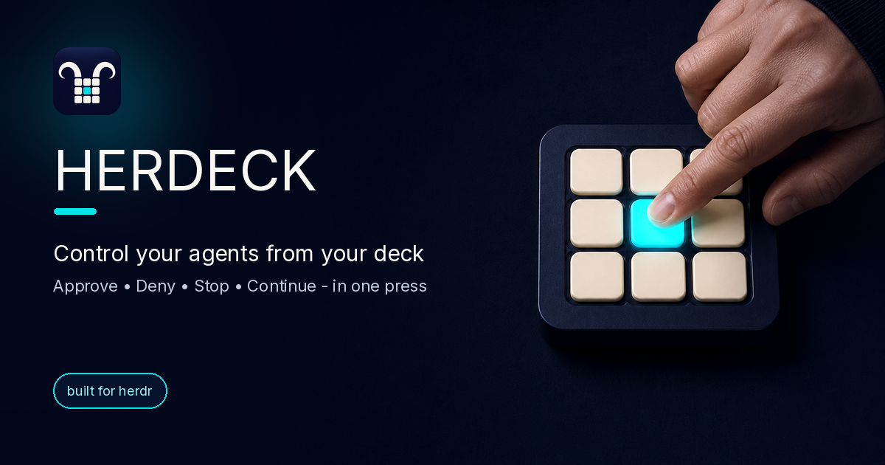

# Herdeck




[**Download Herdeck for Apple Silicon macOS**](https://github.com/vaclavik-xyz/herdeck/releases/latest)
· [Linux packages](https://github.com/vaclavik-xyz/herdeck/releases/latest)

Turn an Ulanzi Stream Controller D200 (or an Elgato Stream Deck) into a control
panel for AI coding agents running under
[herdr](https://github.com/herdrdev/herdr). See blocked agents at a glance
and Approve / Deny / Stop / Continue with one press — on the hardware deck, a
browser dashboard, or a native desktop window.

> **What is herdr?** herdr runs your AI coding agents (Claude, Codex, Cursor,
> Gemini, …) in managed terminal panes and exposes their live state over a local
> socket. herdeck is a front-end for it and requires **herdr >= 0.7.4** (the
> metadata tokens its waiting state is derived from shipped in 0.7.4; check
> with `herdr status`, upgrade with `herdr update`).
> You install and run herdr separately; or use the mock path below to try
> herdeck standalone.

## Current status

Herdeck `0.1.1` ships a signed and notarized installer for Apple Silicon macOS,
plus AppImage, deb, and rpm packages for x86_64 and arm64 Linux. Installed
macOS and Linux AppImage builds update themselves through signed GitHub Release
artifacts. Intel macOS, Homebrew, and a signed Elgato plugin are not available
yet.

What works today:

- Ulanzi D200 control on macOS, including reconnect after sleep/wake.
- Native Tauri desktop window with onboarding, settings, profiles, and Czech or
  English UI. Its bundled runtime drives the D200 without a separate Python
  installation.
- Browser dashboard and hardware-free demo mode.
- Local, remote, and mixed Herdr sessions; remote bridges run over Tailscale.
- `herdeck-ctl` automation, live terminal preview, notifications, usage limits,
  macros, and configurable safety profiles.
- Elgato Stream Deck plugin with a bundled backend; its current package is a
  local arm64 macOS build and is not signed or notarized.

## Install

Official desktop packages contain the complete Herdeck runtime. Users do not
need Python, Node.js, Rust, or a source checkout. Herdr is a separate application
and must already be running locally or on a reachable remote machine.

### macOS installer (recommended)

1. Download `herdeck_<version>_aarch64.dmg` from
   **[GitHub Releases](https://github.com/vaclavik-xyz/herdeck/releases/latest)**.
2. Open the DMG and drag **herdeck** to `/Applications`.
3. Eject the DMG, quit Ulanzi Studio, connect the D200, and open Herdeck from
   `/Applications`.
4. Choose a Herdr session in onboarding. No Herdeck config or token is
   needed when Herdr runs under the same macOS user.

The app is Developer ID signed and Apple notarized. It contains the complete
D200 runtime, stays active in the menu bar when its window is closed, and
reopens the deck automatically after sleep or USB reconnect. Enable
**Herdeck menu → Start at login** to bring the runtime back after a reboot.

When a new signed release is available, the desktop window offers **Install and
restart**. The update replaces the application and bundled runtime together.

### Linux packages

Download the package for your distribution and CPU architecture from
**[GitHub Releases](https://github.com/vaclavik-xyz/herdeck/releases/latest)**:

| Format | x86_64 | arm64 |
| --- | --- | --- |
| AppImage | `herdeck_<version>_amd64.AppImage` | `herdeck_<version>_aarch64.AppImage` |
| Debian / Ubuntu | `herdeck_<version>_amd64.deb` | `herdeck_<version>_arm64.deb` |
| Fedora / RHEL | `herdeck-<version>-1.x86_64.rpm` | `herdeck-<version>-1.aarch64.rpm` |

Install a native package with the distribution package manager:

```bash
sudo apt install ./herdeck_0.1.1_amd64.deb
# or
sudo dnf install ./herdeck-0.1.1-1.x86_64.rpm
```

The portable AppImage needs no installation:

```bash
chmod +x ./herdeck_0.1.1_amd64.AppImage
./herdeck_0.1.1_amd64.AppImage
```

The commands above use the current x86_64 filenames; use the corresponding arm64
filename from the table on an arm64 machine. AppImage builds include the signed
in-app updater. Update `.deb` and `.rpm` installations by downloading the newer
package and running the same `apt install` or `dnf install` command again. Ulanzi
D200 hardware control is currently verified only on macOS.

### Source installation requirements

- Python 3.12 or 3.13.
- [herdr](https://github.com/herdrdev/herdr) 0.7.4 or newer for live agents
  (the metadata tokens the waiting state is derived from shipped in 0.7.4).
- Tailscale only when the Herdr host and the deck host are different machines.
- For hardware: an Ulanzi D200 or an Elgato Stream Deck. Quit the vendor's app
  before using the D200 because it holds the USB device.

Start with a checkout and an isolated Python environment:

```bash
git clone https://github.com/vaclavik-xyz/herdeck.git
cd herdeck
python3 -m venv .venv
.venv/bin/python -m pip install --upgrade pip
```

Then choose the front-end you want.

### Ulanzi D200 from source (macOS)

Install the D200 dependencies, check the local Herdr connection, and start
Herdeck:

```bash
.venv/bin/pip install -e ".[deck]"
.venv/bin/herdeck-doctor
.venv/bin/herdeck
```

If Herdr is running under the same macOS user at its default socket, no Herdeck
config or token is needed. The first run discovers it automatically. If no D200
is attached, `herdeck` falls back to the browser dashboard.

### Browser dashboard or demo

Install the development/rendering dependencies and choose either live local
agents or synthetic demo agents:

```bash
.venv/bin/pip install -e ".[dev]"

HERDECK_SHOW_URL_TOKEN=1 \
  .venv/bin/herdeck-web run --allow-query-token # live local Herdr

HERDECK_MOCK=1 HERDECK_SHOW_URL_TOKEN=1 \
  .venv/bin/herdeck-web run --allow-query-token # standalone demo
```

The command prints a complete loopback URL. Its query token is a credential;
this opt-in is intended only for the local quick start. Set `HERDECK_WEB_BIND`
to your Tailscale IP only when you intentionally need access from another
device, and never bind the dashboard to a public or untrusted interface.

### Native desktop app

To build the desktop app yourself, install Node.js
`^20.19.0 || ^22.13.0 || >=24.0.0`, Rust, and the platform's Tauri build
prerequisites in addition to Python:

```bash
.venv/bin/pip install -e ".[packaging,deck]"
cd desktop
npm ci
bash scripts/build-app.sh
```

On macOS, the application bundle is produced under
`desktop/src-tauri/target/release/bundle/macos/`. Open it directly or copy it to
`/Applications`. A local build is unsigned unless you provide the release
signing environment; official GitHub Release builds are signed and notarized.

For development, use `npm run tauri dev` instead. See
[`desktop/README.md`](desktop/README.md) for the frontend, Rust, and sidecar test
commands.

### Elgato Stream Deck plugin (arm64 macOS)

The plugin package contains its own frozen Herdeck backend, so the destination
Mac does not need Python. Building the current unsigned package requires Node.js:

```bash
.venv/bin/pip install -e ".[packaging]"
cd streamdeck
npm ci
npm run package
open xyz.vaclavik.herdeck.streamDeckPlugin
```

The final command hands the package to the Stream Deck app. Gatekeeper may warn
because the current plugin package is not signed or notarized.

### Remote Herdr host

When Herdr runs on another machine, install Herdeck there from the same checkout
and run a persistent bridge bound only to its Tailscale address. On macOS:

```bash
.venv/bin/pip install -e .
TAILSCALE_IP="$(tailscale ip -4 | head -n 1)"
.venv/bin/herdeck-service install bridge \
  --system \
  --bind "$TAILSCALE_IP" \
  --port 8788 \
  --socket "$HOME/.config/herdr/herdr.sock" \
  --server-id workbox \
  --token-file "$HOME/.config/herdeck/bridge-token"
.venv/bin/herdeck-service status bridge --system
```

Then connect the deck Mac through the desktop onboarding flow. For unattended
or agent-managed setup, multiple sessions, Linux systemd, secure token transfer,
verification, and rollback, follow the
**[agent setup runbook](docs/agent-setup.md)**. Do not copy token values into
TOML files or command-line arguments.

### Update a source installation

The automatic updater belongs to the installed desktop app. For a source
checkout, update the repository and refresh its environment explicitly:

```bash
git pull --ff-only
.venv/bin/pip install -e ".[deck]" # use .[dev] or .[packaging,deck] as needed
.venv/bin/herdeck-doctor
```

An installed bridge keeps using the Python environment recorded in its service.
Run the same `herdeck-service install bridge ...` command again when its launchd
definition or startup options change; the installer replaces the service and
rolls its plist back if launchd rejects the update.

To push a committed ref to a runtime or bridge host that runs from source —
snapshot, install, restart its service, health-check, with a one-line
rollback — use `scripts/deploy-host.sh --role runtime|bridge --host HOST`; see
[updating a deployment](docs/updating-a-deployment.md).

### macOS dev build

Maintainers can create a disposable Apple Silicon build from any branch with
the **dev-build** workflow under GitHub Actions. Download its
`herdeck-dev-macos-arm64` artifact, extract the included archive, and move
`Herdeck Dev.app` to `~/Applications` or `/Applications`.

The dev app has its own bundle ID, stores configuration under
`~/.config/herdeck-dev`, uses a separate `herdeck-dev` Keychain namespace, and
does not use the stable updater. Its window title contains the source commit so
test feedback can identify the exact build. It can sit next to the stable app,
but quit the stable Herdeck before testing D200 hardware because only one
process can own the USB device.

Dev artifacts are Developer ID signed but not notarized, expire after 14 days,
and are intended only for trusted internal testing. macOS therefore requires
**Control-click → Open** on first launch. Public releases remain both Developer
ID signed and Apple notarized.

## Try it in 30 seconds (no hardware, no herdr)

```bash
git clone https://github.com/vaclavik-xyz/herdeck.git && cd herdeck
python3 -m venv .venv
.venv/bin/pip install -e ".[dev]"
HERDECK_MOCK=1 HERDECK_SHOW_URL_TOKEN=1 \
  .venv/bin/herdeck-web run --allow-query-token
```

This renders the deck in your browser with lively synthetic agents using the
exact device code — no Stream Deck and no herdr required. Open the complete
loopback URL printed by the command and treat its query token as a credential.

## Multiple Herdr sessions

Herdeck can combine multiple local named sessions and remote bridges in one
deck. Open **Settings → Servers** (or the connection picker in the floating
deck), select any discovered local sessions, and optionally keep one or more
saved remote bridges enabled. Changes reconnect in place; the Herdeck process
does not need a restart.

Local discovery covers the default `~/.config/herdr/herdr.sock` plus named
`~/.config/herdr/sessions/<name>/herdr.sock` sockets. The selection is
device-local and is stored in `local.toml`:

```toml
[local]
herdr_sessions = ["default", "review"]
```

Remote Herdr instances still run one `herdeck-bridge` each and appear as
separate `[[servers]]` entries. Their WebSockets travel directly over the
Tailscale network; Tailscale SSH is not part of the data path. Local and remote
agents are keyed by server/session id, so commands always return to the bridge
that supplied the pane.

For agent-managed setup without the connection UI, use the
**[agent setup runbook](docs/agent-setup.md)**. It covers topology discovery,
safe token transfer, local/remote/mixed configuration, multiple bridge
services, verification, troubleshooting, and rollback. A device-local template
is available as [`local.example.toml`](local.example.toml).

### Where a server's token comes from

A `[[servers]]` entry names its bridge token, never holds it. The runtime
tries, in order:

1. the environment variable named by `token_env`;
2. the file named by `token_file` (`~` is expanded; content is stripped);
3. the OS keychain entry named by `token_env` (what the desktop app's
   Connections editor writes).

```toml
[[servers]]
id = "local"
url = "ws://127.0.0.1:8788"
token_env = "HERDECK_TOKEN"                        # env, then keychain
token_file = "~/.config/herdeck/bridge-token"      # used when the env var is unset
```

A server needs at least one of `token_env` and `token_file`. The token file
follows the bridge's rules: a regular file that only its owner can read
(`chmod 600`). A file readable by the group or others is refused with a clear
config error, not skipped. A launchd or systemd runtime has no shell
environment (and `herdeck-service` refuses `--env` names containing `TOKEN`),
so give it a `token_file` or a keychain entry.

A config file that exists but cannot be loaded (a token no source has, a
malformed value) never starts the demo fleet. The deck shows an empty grid and
a red `CONFIG ERROR` panel naming the problem, and `/health` and
`/maintenance` report `config_error`. The runtime logs it at ERROR. It watches
the config and token files and re-checks every 10 s, so fixing the problem
recovers the deck without a restart. The demo still starts on the first run
(no config), with `HERDECK_MOCK=1`, or when you choose it in onboarding.

### Diagnosing a dark deck

Run `herdeck-doctor` to diagnose setup problems — it checks the herdr socket,
config/mode, deck availability, and (for remote) where each server's token
resolved (`env`, `file` or `keychain`), printing a
pass/fail checklist with hints (it never prints token values). It also compares
versions: the running runtime against this install, and every bridge against
the runtime, and asks each bridge whether herdr answers it.

When the deck goes dark, the runtime's token-gated `GET /health` says why: its
`version`, `protocol`, `pid` and `uptime_s`; `config_error` when the config
does not load; per server under `servers`
(`connected`, `last_error`, `since` in unix ms, `attempt`, `bridge_version`,
`protocol_supported`); the D200 under `d200` (`connected`, `last_frame_at`,
`last_error`, `lock_owner` when another runtime holds `d200.lock`); and
notification counters (`queued`, `acked`, `fallback`, `dropped`, `pending`).
The desktop window turns the same data into a one-line warning, for example
`runtime 0.8.0 ≠ app 0.8.1 — restart the runtime` or
`bridge local: token rejected 3 min · D200: disconnected 2 min`.

## Controlling agents from the CLI (`herdeck-ctl`)

`herdeck-ctl` drives agents from a terminal — for scripting or for a lead agent
orchestrating others — using the same bridge and answer profiles as the deck.

```bash
herdeck-ctl ls --json                          # list agents + status
herdeck-ctl wait --any --until blocked --json  # block until one needs input
herdeck-ctl approve local:w1:p1                # approve a blocked agent
herdeck-ctl focus local:w1:p1                  # bring its pane to the foreground
herdeck-ctl send local:w1:p1 "run the tests"   # send text (submits immediately)
```

Target an agent by `server:pane_id` or a fuzzy match on its label/repo/branch.
Common options (`--json`, `--server`, `--config`, `--timeout`) work before or
after the subcommand. `wait` is the one exception: its own `--timeout` (max
seconds to wait, default: no limit) goes after it, e.g.
`wait --any --until blocked --timeout 60`.

Exit codes: `0` ok · `2` usage · `3` skipped (agent not blocked) · `4`
unknown/ambiguous agent · `5` connection/config error · `124` `wait` timed out.
Actions that clear a block (`approve`/`deny`/`stop`) wait until the agent leaves
`blocked` before returning (tune with `--settle S` / `--no-settle`).

## Architecture
- `herdeck-bridge` runs on each server: connects to herdr's local Unix socket,
  maps/filters panes to agents, and exposes an authenticated WebSocket bound to
  the Tailscale interface only. It pushes live status changes (poll + diff) so
  the deck updates without manual refresh. **No SSH tunnel is in the data path.**
- The Mac app connects over Tailscale and drives the deck. It resyncs fully on
  every reconnect, so sleeping and waking the Mac needs no manual steps.

```
agents → herdr (Unix socket) → herdeck-bridge → WebSocket/Tailscale → Mac app → D200
```

## Remote bridge details

Herdr's default socket is `~/.config/herdr/herdr.sock` on macOS and Linux. The
supported macOS system-service installer is shown under **Remote Herdr host**
above; on Linux `herdeck-service install bridge` writes a systemd user unit
(hand-written example: [`deploy/herdeck-bridge.service`](deploy/herdeck-bridge.service)).

For pushing a new version to hosts that already run one — what needs updating
where, rebuilding the desktop app, and how to verify a deploy landed without a
display — see [docs/updating-a-deployment.md](docs/updating-a-deployment.md).

Each remote Herdr instance runs one authenticated `herdeck-bridge` and appears
as one `[[servers]]` entry. The config `id` is the authoritative routing ID on
the deck; `HERDECK_SERVER_ID` is only the bridge's self-reported label. Keep
ports, config IDs, token environment names, and token files unique when several
bridges share a host.

Every bridge snapshot carries `herdeck_version`. An authenticated client can
also send `{"type": "health", "req": "<id>"}` over the same WebSocket; the
bridge answers `{"type": "result", "req": "<id>", "data": {"herdeck_version",
"protocol", "herdr_reachable", "clients", "managed"}}`. `herdeck-doctor` uses it; a bridge
older than 0.8.1 answers with an `error` frame instead. `managed` says whether
the bridge may update itself (below).

### Status history and statistics

A bridge that advertises the `history` capability records how its agents
spend their time. Each time a pane's status changes (working, blocked, idle,
waiting, done; the same effective status the deck shows), the bridge appends
one row for the stretch that just ended: pane and terminal id, agent type,
repo/project/label, the old and new status, start and end time, and whether a
blocked stretch ended after an answer sent through herdeck (`act`,
`send_text`, `choose_if_blocked`). An answer typed straight into the terminal
cannot be seen by the bridge, so it only ends the block. The rows live in
`~/.local/state/herdeck/history.sqlite` (or `$XDG_STATE_HOME`; the embedded
local bridge uses `local-bridge-history.sqlite`), mode `0600`, SQLite WAL,
kept for 30 days and at most 200,000 rows. Writes run on a background thread
in batches, and a store error only logs a warning. A corrupt file is moved
aside and a new one is started.

Clients ask with `{"type": "stats", "req", "range_days": 1|7|30, "group_by":
"agent"|"repo"|"agent_type", "tz_offset_min"}` (the read-only token is enough).
The answer sums working/blocked/idle/waiting/done time per group and per day
(calendar days in the client's timezone; 1 = today), counts blocked episodes,
answers and entries into done, and gives the median and p90 time to answer
(the length of blocked stretches that ended with the pane moving on). The
runtime serves it as `GET /stats?range=7&group=repo` (token auth), asks every
connected bridge with the capability and sums their answers.

### Bridge self-update

A bridge installed as a **managed** service (`herdeck-service install bridge
--managed`: its own venv under `~/.local/share/herdeck/bridge-venv` with a
`managed.json` marker at the venv root) can be updated from the deck host
without a shell on the bridge host. The runtime's token-authenticated `POST
/maintenance/servers/<id>/update` sends that bridge `{"type": "update", "req":
"<id>", "version": "<the runtime's version>"}`; the bridge

1. downloads `herdeck-<version>-py3-none-any.whl` from the GitHub release
   `v<version>` and checks its SHA-256 against the release's `SHA256SUMS`
   (no matching checksum, no install). A missing wheel is an error; only a
   version older than 0.10.0 (the first release that publishes wheels) could
   fall back to `git+https://github.com/vaclavik-xyz/herdeck@v<version>` — unreachable today, because
   the bridge never installs anything older than 0.10.0 either;
2. installs it into its own venv with `pip` (or `uv` when the venv has no pip),
   streaming `{"type": "progress", "req", "stage", "message"}` frames;
3. imports `herdeck.bridge` and reads the installed version back in a fresh
   interpreter, rewrites `managed.json` to describe the new artifact, answers
   `{"type": "result", "req", "data": {"updated": "<version>", "source":
   "wheel"|"git", "restarting": true}}` and exits cleanly, so launchd
   (`KeepAlive`) or systemd (`Restart=always`) starts the new version.

Any failure keeps the old version serving and answers `{"updated": null,
"error": {"code", "message", "output"}}` with the installer's output tail
(codes: `not_managed`, `invalid_version`, `downgrade`, `busy`, `failed`). A
bridge running from a source checkout or an editable install always refuses
with `not_managed`; the read-only token cannot send `update` at all. Only one
update runs at a time. A version older than the running one is refused unless
the message carries `"allow_downgrade": true`, and nothing older than 0.10.0
(the first release with self-update) is ever installed: the bridge would come
back unable to update itself.

The runtime answers the route with `{"ok", "code", "message", "server_id",
"target", "output", "progress": [{"seq", "stage", "message"}], "next"}`, where
`code` is `updated`, `pending`, `current`/`newer` (the bridge already runs the
runtime's version or a newer one — nothing is sent, so an older runtime never
pulls a shared bridge back), `not_managed`, `readonly`, `failed`, `downgrade`,
`busy`, `unsupported` (a bridge from before self-update) or `disconnected`. If
the connection drops before the reply, the update stays `pending` until the
bridge reconnects at the target version (or 15 minutes pass). The POST
waits up to `wait_ms` (default 15 s, at most 25 s); a `pending` answer is
followed with `GET /maintenance/servers/<id>/update?after=<next>&wait_ms=<ms>`
(token as a query parameter, like every GET), which returns on the next progress
line or the outcome.

## Profiles and customization

Herdeck supports a shareable `config.toml` and a device-local `local.toml`.
The shareable file defines profiles and reusable blocks for theme, view,
launcher, macros, notifications, and safety. The local file stores the active
profile and device-specific settings such as deck type, socket path, web bind,
icon overrides, selected Herdr sessions, and hardware tuning. Start from
[`local.example.toml`](local.example.toml) when configuring it outside the UI.

Switch profiles from the deck through `+ New` -> `Profiles`, or set
`HERDECK_PROFILE=mobile` to lock a process to a profile. Use `local.toml` for
values you do not want to share between devices:

```toml
active_profile = "mobile"

[local]
deck = "web"
herdr_socket = "~/.config/herdr/herdr.sock"
herdr_sessions = ["default"]       # select several named local sessions if wanted
web_bind = "127.0.0.1"
web_port = 8800
icons_dir = "~/herdeck-icons"
terminal_app = "Ghostty"           # optional, macOS: see below

[hardware]
brightness = 80
debounce = 0.25
keep_alive_interval = 5.0
tick_interval = 0.4
# d200_standard_writer = false     # D200 firmware compatibility writer (docs/agent-setup.md)
# uhubctl = ""                     # path to uhubctl for the USB power-cycle ("" = auto)
# usb_hub = "20-1"                 # pin the D200's hub location + port for the power-cycle
# usb_port = 2                     # (otherwise the last place the D200 was seen is used)
```

A tile press asks herdr to focus that agent's pane, which switches the pane
inside the herdr client but leaves its terminal window wherever it was. When
the herdr client runs on the deck machine, set `[local].terminal_app` to the
app hosting it (`"Ghostty"`, `"iTerm"`, `"Terminal"`, ...) and herdeck brings
that app forward (`open -a`) once herdr confirms the focus. macOS only; empty
(the default) leaves it off. It does nothing useful when the pane is shown on
another machine.

## Development without hardware

**Browser simulator (recommended).** `HERDECK_DECK=web` runs a pixel-faithful
deck in the browser — it renders tiles/panel with the exact device code and turns
clicks into presses. It is a front of the same runtime the desktop app and
`herdeck.runtime` use (`herdeck.host`: DeckApp + LiveSource + Orchestrator), so
alerts, drills and the cockpit API behave the same everywhere. Two ways to use it:

- **Against the live bridge** (real agents, even remotely over Tailscale):
  ```bash
  HERDECK_DECK=web HERDECK_CONFIG=~/.config/herdeck/config.toml \
  HERDECK_WORKBOX_TOKEN=<token> herdeck
  # open http://127.0.0.1:8800  (set HERDECK_WEB_BIND to a Tailscale IP for remote)
  ```
- **Fully offline** (the demo fleet — no bridge, config, or token):
  ```bash
  HERDECK_MOCK=1 HERDECK_DECK=web herdeck
  # open http://127.0.0.1:8800
  ```

`python -m herdeck.app` still works as an alias of `herdeck`.

`HERDECK_WEB_PORT` (default 8800) and `HERDECK_WEB_BIND` (default 127.0.0.1)
configure the server. Click a tile to press it; click the panel to page.
Long-press or right-click an agent tile (or focus it and press `Shift+Enter`) to
open a live read-only terminal preview; close it with `Esc` or ×. The bridge
host needs herdr >= 0.7.3 for `herdr terminal session observe`.

The simulator URL token now grants both deck controls and visibility into agent
terminals. Treat it as a credential and bind the simulator only to loopback or
your trusted Tailscale interface — never `0.0.0.0`, a public IP, or an untrusted
LAN.

### Running as a service

`herdeck-web` makes the browser runtime explicit, and `herdeck-service` installs
macOS services without placing token values in plist files. Use a system daemon
for an always-on remote bridge; web and development services remain background
LaunchAgents:

```bash
herdeck-service install bridge --system --bind 100.x.y.z --server-id workbox
herdeck-service install web --bind 100.x.y.z --config ~/.config/herdeck/config.toml
herdeck-service install runtime --config ~/.config/herdeck/config.toml
herdeck-service status bridge --system
herdeck-service restart runtime
```

`install bridge --managed [--version X]` installs the herdeck release into its
own venv (`~/.local/share/herdeck/bridge-venv`) and runs the bridge from there;
`--env KEY=VALUE` (repeatable, non-secret names only) adds launch environment;
`status <kind> --json` prints a machine-readable status. The desktop app's
bundled runtime binary runs the same CLI as `herdeck-deckapp service ...`. See
[docs/updating-a-deployment.md](docs/updating-a-deployment.md).

The `runtime` kind runs the headless deck runtime (`herdeck.runtime`: D200 +
the desktop window's API) as a login-session LaunchAgent, logging to
`~/Library/Logs/herdeck-runtime.log`. With `--from-app [/Applications/herdeck.app]`
it runs the frozen runtime bundled in the desktop app instead of a Python
checkout, and the app's updater restarts it whenever it installs a new version.
On Linux every kind installs as a systemd `--user` unit (`--system` is
macOS-only).

System installation asks for macOS administrator approval only for the
root-owned LaunchDaemon operations. The daemon still runs as the invoking user.
It replaces a legacy user/GUI bridge only after launchd accepts and reports the
new service; a failed migration restores the previous service. The install
command creates the bridge token at
`~/.config/herdeck/bridge-token` with mode `0600` when needed. Web capability
URLs are disabled by default and are no longer written to normal startup logs.
The bridge remembers when each pane entered its current status in
`~/.local/state/herdeck/bridge-status-since.json` (or `$XDG_STATE_HOME`, mode
`0600`), so the deck's elapsed-time text survives bridge and runtime restarts.
`herdeck-web url --allow-query-token` prints one only when the server was also
started with that explicit legacy opt-in. Do not enable it for a persOS cockpit.

`GET /healthz` is an unauthenticated, non-sensitive liveness response. The
token-protected `GET /readyz` also reports readiness when called with
`X-Herdeck-Token`. Probe a running
web service without exposing its token with:

```bash
herdeck-doctor --web-url http://100.x.y.z:8800
```

### Reverse proxy and cockpit embed

Herdeck can run behind an HTTPS reverse proxy under a preserved path prefix.
Keep the backend on loopback, forward `/herdeck/` without stripping the prefix,
and opt in only the exact HTTPS origin allowed to frame the deck:

```bash
herdeck-service install web \
  --bind 127.0.0.1 \
  --config ~/.config/herdeck/config.toml \
  --base-path /herdeck \
  --public-origin https://cockpit.example \
  --frame-ancestor https://cockpit.example

herdeck-doctor --web-url https://cockpit.example/herdeck/
```

By default the Content Security Policy uses `frame-ancestors 'none'`. Frame
ancestors must be explicit HTTPS origins; wildcards, paths, and forwarded trust
headers are not accepted. `HERDECK_WEB_FRAME_ANCESTORS` is the comma-separated
environment equivalent of repeated `--frame-ancestor` options.

An embed policy requires an explicit HTTPS `public_origin`. Hosting Herdeck
under the cockpit's own origin (as in the `/herdeck` example) is the most robust
setup and keeps `SameSite=Strict`. If an allowed parent has a different origin,
Herdeck emits `SameSite=None; Secure`; that deployment also depends on the
browser allowing third-party cookies for the iframe.

The persistent `?token=...` browser bootstrap is disabled by default. It is
available only with the explicit `--allow-query-token` legacy opt-in. A persOS
cockpit instead mints a bounded `HttpOnly; SameSite=Strict` browser session
through its authenticated server-side handoff. Browser writes additionally
require an exact `Origin` match. Existing automation continues to use
`X-Herdeck-Token`. When
`HERDECK_WEB_PUBLIC_ORIGIN` is HTTPS the session cookie is also `Secure`.

For a persOS cockpit, including the semantic agent API, server-to-server browser
session handoff, guarded approve/deny/stop/send-text calls, and the deployment
contract, see [docs/persos-cockpit.md](docs/persos-cockpit.md).

### Optional work/run context

Orchestrators can attach display-only work identity to a Herdr pane through
`pane.report_metadata` tokens. Herdeck recognizes these bounded keys:

```text
work_source = github
work_item   = vaclavik-xyz/herdeck#123
work_run    = run-42
work_url    = https://github.com/vaclavik-xyz/herdeck/issues/123
```

`work_url` must be HTTPS and is display metadata only; Herdeck never opens or
executes it automatically. Add
`source`, `work_item`, or `run` to `view.tile_primary` / `tile_secondary` to
render the context. Any Herdr token can be rendered with `$name`, for example
`$summary`, `$model`, `$waiting_on`, or `$progress`. Interactive Telegram alerts
include `work_item` when set.

Herdr's display-only pane `title` is also available as the built-in `title`
tile token. With the default layout, a non-empty title replaces the compact
`tab · branch` secondary line; panes without a title keep the existing fallback.
An explicit `view.tile_secondary` always wins.

The default primary line uses `project`: the editable Herdr workspace name or
T3 project title, falling back to the repository name when absent. Renaming a
workspace updates its tiles without changing their session titles or identities.
Custom `tile_primary` / `tile_secondary` lists can use `project` too; explicit
`repo` tokens retain their previous behavior (repository/worktree label for
Herdr, project title for T3). The legacy `tile_fields` entry `repo` still controls
whether the default primary line is visible. `workspace` is the raw Herdr label
and is empty for T3; use `project` for a mixed overview.

When Herdr exposes the pane-scoped `refresh` action from the
`zhangzujian.auto-session-title` plugin, a non-blocked agent's detail view also
shows **Retitle** (Czech: **Nový název**). Pressing it asks the plugin to
generate a fresh title for that exact pane. The action stays hidden when the
plugin is missing or disabled and while approval controls take priority on a
blocked agent.

### Subagent tracking

An agent tile shows a fork badge with a count (`⑂3`) while the pane's agent has
subagents running. Claude Code and Codex report subagents through hooks, and
`herdeck-subagent-hook` turns them into a Herdr pane metadata token
`subagents=<running>/<total>` (source `herdeck:subagents`, 15-minute TTL) that
the bridge forwards like any other token (`$subagents` also works in
`tile_primary` / `tile_secondary`).

The hook runs on the machine where the agents run (next to herdr and the
bridge), inside the agent's herdr pane. It only uses the standard library and
the local `herdr` CLI, prints nothing, always exits 0 and gives up after 2 s;
outside a herdr pane (no `HERDR_PANE_ID`) it does nothing. Per pane it keeps a
small spool in `~/.cache/herdeck/subagents/<pane>.json` (0600, at most 20
entries): a running subagent with no activity for 10 minutes counts as stale
and is dropped after 30 minutes, and the spool resets when the agent session
starts over (`startup` / `clear` or a new session id).

The bridge on that machine also reads these spools and sends each pane's
subagents along with the pane (bridge capability `subagents`). The desktop
agent card (Option/Alt-click a tile) then lists them, newest first: type,
description, status (running, done, failed, or "no signal" for a stale one),
running time or total time, with nested subagents indented. The cockpit's
`GET /api/v1/agents` carries the same list in each record's `subagents`.

**Install the hooks.** On the agents' Mac run

```bash
herdeck-service hooks install            # both; or --agents claude / --agents codex
herdeck-service hooks status [--json]    # what is installed, per agent
herdeck-service hooks uninstall
```

or switch **Subagent tracking** on per agent in the desktop app (Maintenance,
under each bridge; see below). The installer adds the entries shown below to
each event's array and leaves every other hook (herdr, herdwatch, moshi, your
own) and every other setting alone. Its own entries are the ones whose command
contains `herdeck-subagent-hook`, and `uninstall` removes only those. Before a
file changes, its old bytes are copied to `<file>.bak-herdeck-<timestamp>`, and
the new file is written atomically with the old file mode (JSON with 2-space
indent). Running `install` again changes nothing. A file that is not valid
JSON, or whose `hooks` is not an object of arrays, is reported and left as it
is. The command uses `--hook-path`, else `herdeck-subagent-hook` next to the
Python that runs it (a venv's `bin/`), else the one on `PATH`. It honours
`CLAUDE_CONFIG_DIR` and `CODEX_HOME`, and `status` reports the directory it
used (`config_dir`, `config_dir_source`: the variable name or `home`). The
bridge usually runs under launchd or systemd without your shell's environment,
so if you rely on either variable, set it for the bridge service too
(`herdeck-service install bridge --env CODEX_HOME=...`); otherwise the app's
switches edit `~/.claude` / `~/.codex`. A symlinked hook file (dotfiles, stow)
stays a symlink: the link's target is edited, and the backup lands next to the
target. Only entries whose program (the command's first word) is
`herdeck-subagent-hook` count as herdeck's. It never switches Codex's
`[features] hooks` on: `status` reports whether it is on
(`features_hooks_enabled`), and after an install Codex asks you once to trust
the new hooks (`/hooks` in a Codex session; `needs_trust` reminds you, since
Codex keeps that trust record itself). Agents that are already running pick
the hooks up after a restart. `herdeck-doctor` reports the state per agent.

The bridge offers the same thing to runtimes (capability `hooks`, **full token
only**; the read-only token is refused): `{"type": "hooks", "req", "action":
"status"|"install"|"uninstall", "agents": ["claude", "codex"]}` runs on the
bridge's machine off the event loop (at most 10 s) and answers `{"type":
"result", "req", "data": {"action", "ok", "hook_path", "agents": {"claude":
{...}, "codex": {...}}}}`, where each agent carries `installed`, `events`,
`missing_events`, `file`, `command`, `error`, `changed`, `backup` and, for
Codex, `needs_trust` and `features_hooks_enabled`. The runtime relays it as
`GET /maintenance/servers/<id>/hooks` and `POST /maintenance/servers/<id>/hooks`
`{"action", "agents"}` (token auth), answering `{"ok", "code", "message",
"server_id", "agents"}` with `code` `ok`, `failed`, `readonly`, `unsupported`,
`disconnected` or `timeout`. `GET /maintenance` carries a short summary per
server under `hooks` (`null` when unknown). The runtime asks once per
connection and refreshes it after every action.

To add the hooks by hand instead: if `herdeck-subagent-hook` is not on the
agents' `PATH`, use its absolute path (`command -v herdeck-subagent-hook`). If
you already have hooks for an event, add the entry to that event's existing
array.

**Claude Code**: add to `~/.claude/settings.json`:

```json
{
  "hooks": {
    "SubagentStart": [
      { "hooks": [{ "type": "command", "command": "herdeck-subagent-hook --provider claude", "timeout": 5, "async": true }] }
    ],
    "SubagentStop": [
      { "hooks": [{ "type": "command", "command": "herdeck-subagent-hook --provider claude", "timeout": 5, "async": true }] }
    ],
    "PostToolUse": [
      { "matcher": "Agent|Task", "hooks": [{ "type": "command", "command": "herdeck-subagent-hook --provider claude", "timeout": 5, "async": true }] }
    ],
    "PreToolUse": [
      { "matcher": "*", "hooks": [{ "type": "command", "command": "herdeck-subagent-hook --provider claude", "timeout": 5, "async": true }] }
    ],
    "SessionStart": [
      { "matcher": "startup|clear", "hooks": [{ "type": "command", "command": "herdeck-subagent-hook --provider claude", "timeout": 5, "async": true }] }
    ]
  }
}
```

`PostToolUse` on the `Agent` tool catches background launches and results when
a start or stop event was missed. `PreToolUse` is the heartbeat: it fires for
every tool call, and does work only when the call comes from inside a
subagent. Without it, a subagent that runs for more than 10 minutes shows as
stale.

**Codex**: add to `~/.codex/hooks.json`. Hooks must be enabled
(`[features] hooks = true` in `~/.codex/config.toml`), and Codex asks you to
review and trust new hooks (`/hooks`):

```json
{
  "hooks": {
    "SubagentStart": [
      { "hooks": [{ "type": "command", "command": "herdeck-subagent-hook --provider codex", "timeout": 5 }] }
    ],
    "SubagentStop": [
      { "hooks": [{ "type": "command", "command": "herdeck-subagent-hook --provider codex", "timeout": 5 }] }
    ],
    "SessionStart": [
      { "hooks": [{ "type": "command", "command": "herdeck-subagent-hook --provider codex", "timeout": 5 }] }
    ]
  }
}
```

**Headless.** `HERDECK_FAKE_DECK=1 herdeck` uses an in-memory
renderer (no UI). `scripts/e2e_verify.py` connects the pipeline to a bridge and
prints the resulting tiles (`HERDECK_E2E_URL` / `HERDECK_E2E_TOKEN`).

## Desktop app

herdeck also ships a native **desktop app** (Tauri + Svelte), as two windows
with fixed roles: an app window with the full control room (onboarding,
connections, live status, deck preview, and settings) and a compact,
borderless deck window that overlays your other work. Either can be shown or
hidden independently, and the deck can be kept always on top. Resize the deck
with **⌘+** / **⌘−** and reset it to 100% with **⌘0**; the chosen scale is
remembered on that Mac. The app attaches to a running herdeck runtime or
spawns its own sidecar. A spawned sidecar exits with the app, even when the app
crashes or is force-quit, and the app switches over to a launchd runtime as
soon as one answers (checked every 12 s). Only one runtime drives the D200 at a
time; see `d200.lock` under [Deck](#the-deck-ulanzi-d200). For development,
run it from `desktop/`:

```bash
# from the repo root
python3 -m venv .venv
.venv/bin/pip install -e ".[dev]"

cd desktop
npm ci
npm run tauri dev   # opens the desktop control room (needs a real desktop session)
```

**Agent card.** Option-click (Alt-click) a tile in the deck window, long-press
it, or press **⌥1**…**⌥0**, and a card opens under the deck with that agent in
full: agent type, repo/branch, workspace/tab, status and how long it has been
in it, and the *whole* blocked prompt (the deck panel fits three lines). The
card offers the same answers as the deck drill (same parsing, same
`[safety]` confirmations), a free-text reply (Enter sends and submits, like
`herdeck-ctl send`; Shift+Enter adds a line), **Focus** and **Stop**. An
answer names the prompt you were reading; if the prompt changed meanwhile the
runtime refuses it as stale instead of answering a question you have not
seen. Every action says what happened, including a bridge that only accepts a
read-only token (`HERDECK_READONLY_TOKEN_FILE`). The card talks to the
runtime's token-authenticated `/agent/*` routes through the desktop shell, so
the token never reaches the page. The demo deck has no card.

**Live terminal** in the card shows the agent's pane read-only (the xterm.js
view the browser dashboard uses, fed by the bridge's `observe`). It needs
herdr 0.7.3+ on the bridge host. Watching stops when you toggle it off, close
the card or hide the window, and the runtime stops any preview nobody has
polled for 15 s. The runtime runs at most two previews at once (the bridge
allows three per connection) and drops the oldest when you open another.

**Maintenance** (Settings → System → Maintenance) does from the app what used
to need a terminal: it lists the app, runtime and bridge versions (a mismatch
is flagged), says where the runtime comes from and can make it a service of
this app (`herdeck-service install runtime --from-app`, run by the bundled
runtime binary, so it is restarted with every app update), restart that
service and open the runtime or app log. For the D200 it explains the state in
words and offers **Restart deck** (close, reopen, full redraw) and, with
[uhubctl](https://github.com/mvp/uhubctl) installed, **Power-cycle USB port**;
when uhubctl needs root the exact `sudo` command is shown to copy. Per bridge
it offers **Update bridge**: the runtime asks that bridge to install the
runtime's version into its managed install and restart, with progress shown
live. A bridge that is not a managed install explains the one-time
`herdeck-service install bridge --managed` instead. Under each connected bridge,
**Subagent tracking** has an on/off switch for Claude Code and for Codex that
installs or removes the subagent hooks on that bridge's machine, after a
confirmation naming the file that changes and the backup it gets. The status
next to it says whether the hooks are installed and, for Codex, whether hooks
still have to be enabled in its config or trusted with `/hooks` (see
[Subagent tracking](#subagent-tracking)). The app window lists each
problem as a compact notice with the same fix as its one button (results show
as toasts; × hides a notice until that problem changes), the deck window shows
a status dot that opens Maintenance, the tray has **Restart deck**, and `[hotkeys].restart_deck` can bind it to a global shortcut (off by
default).

**Statistics** (Settings → Control → Statistics) shows that history for
today, 7 or 30 days, grouped by agent, repository or agent type: how long
agents waited for you, how many answers you gave, the median time to answer,
done tasks, a per-day stacked bar chart and a per-group table. It needs
bridges with status history (see [Status history and
statistics](#status-history-and-statistics)); for an older bridge it says to
update it.

The UI is dark-only by design: it mirrors the deck hardware's black tiles, so
there is no light theme to switch to.

Launched outside a terminal (Finder, Dock, login item, the updater), the app
keeps its own and its sidecar runtime's stderr in a timestamped log:
`~/Library/Logs/herdeck/herdeck.log` on macOS, `~/.local/state/herdeck/herdeck.log`
(or `$XDG_STATE_HOME/herdeck/`) on Linux; `herdeck-dev.log` for the dev build.
It rotates at 5 MB, keeping one previous file (`.1`). Besides warnings it
records how each notification was delivered (native banner or `osascript`
fallback), and why a fallback happened: `reason=no_shell_claim
last_claim_age=…` (the app had not polled for 60 s) or
`reason=shell_native_failed error=…`. It also records when the app's banner
claim was acquired or lapsed, and which runtime the app is on:
`herdeck: runtime plan=attach|spawn reason=…`.

See **Native desktop app** under Install for a local application bundle and
[`desktop/README.md`](desktop/README.md) for architecture and test details.

## The deck (Ulanzi D200)
The D200 has **13 buttons** (a 5×3 grid minus the small status window). The
orchestrator takes the real button count from the driver: agent tiles fill the
slots up to the reserved **+ New** launcher tile. With more agents than tiles,
pressing the status window pages through them (the panel shows `· 1/2`), and a
newly blocked agent automatically pulls the overview back to the first page
where it sorts to the front.

**Triage.** While an agent is blocked the status window shows `▲ needs you`
with the agent that has waited longest. Pressing it opens that agent's prompt;
once you answer (or Stop it), the deck goes straight to the next-longest
blocked agent, and back to the overview when none is left. **Back** leaves the
loop at any time. While the spotlight is up the status window starts triage
instead of paging. In the desktop app, `[hotkeys].next_blocked` (for example
`"CmdOrCtrl+Shift+B"`, off by default) is a global shortcut that shows the deck
and does the same; pressing it again skips to the next blocked agent. State is encoded by color: working = green,
idle = blue, blocked = amber, done = cyan, waiting = violet, error/disconnected
= red. **Waiting** is derived from a pane held by
[herdwatch](https://github.com/vaclavik-xyz/herdwatch) (or any source using
`herdr pane report-agent --custom-status`): the agent itself is done but
background work — CI, a review, a manual marker — is still pending; the tile
shows the holder's label (`CI`, `REVIEW +1`) in place of the status word and
does not animate. By default
the colour shows in the status word and a bottom accent bar; set
`[view].tile_fill` to `tint` (whole tile a darkened shade of the colour) or
`solid` (whole tile the full colour) for more at-a-glance visibility.
Set `[view].tile_icon` to `project` to show the project's favicon in place of
the agent mark, or `both` to keep the agent mark with a small project badge on
its corner. In `project` mode the favicon never rotates, so the `spin`
working animation draws as a `comet` ring around it. The bridge finds the
favicon in the pane's repository
(`favicon.png`, `public/favicon.png`, `app/icon.png`, … then `.ico`, then
`.svg`; at most 256 KiB) and sends it to the deck once; a project without one
gets a coloured letter badge. When the pane's working directory is not inside
a Git repository (say a workspace folder holding several repos), the bridge
looks in that folder itself, so you can drop a `favicon.png` there, and
otherwise in its direct child repositories in name order, but only when the
folder groups at most 4 repos (one project split into app/web, not a folder of
projects; at most 32 child directories are looked at; never for `$HOME`, its
ancestors, or `/`). Override it per repository with
`[view.project_icons]` (`myrepo = "~/icons/myrepo.png"`, a path on the machine
running the deck; quote a repo name that contains a dot, e.g.
`"vaclavik.xyz" = "~/icons/site.png"`, or TOML reads it as a nested table).
SVG icons are rendered with resvg (bundled in the packaged app and the Elgato
plugin). An SVG that references anything outside itself (a file path or URL in
`href`/`url(...)`) is refused and shows the monogram.
With many agents, set `[view].collapse_idle = true` to fold every idle agent
into one `+N` tile at the end of the overview. Pressing it unfolds the idle
agents (the deck jumps to the page with the first one) and a `hide` tile at the
end folds them back; an unfolded list also folds back after a minute without a
press. Pinned agents keep their tile. It applies to the D200, the desktop deck
window and the web simulator; the Elgato plugin keeps one agent per key and
ignores it.

Agents are always grouped by attention priority. Blocked agents are ordered by
how long they have been waiting, longest first. Set `[view].agent_order` to
`"herdr"` to mirror Herdr's workspace and tab positions within the same state
and server (waiting time then only breaks ties); the default `"status"` uses
stable pane ids as the tie-breaker for the other states.

All rendered deck text (tile status words, the panel, the web simulator) and
the desktop app UI speak `[view].language` — `"en"` (default) or `"cs"`; the
desktop settings window offers it as the View → `language` select and switches
live.

The status window can also show **provider subscription limits**. Set
`[usage] providers = ["claude", "codex"]`. Codex is read from the authenticated
`codex app-server` account API. Claude Code exposes its 5-hour and weekly
limits to status-line commands; add this sidecar call near the top of your
existing status-line script, after it has read stdin into `$input`:

```bash
printf '%s' "$input" | herdeck-usage capture-claude >/dev/null 2>&1 || true
```

The default Claude snapshot is `~/.cache/herdeck/claude-usage.json`. Configure
`codex_path` when Codex lives elsewhere. If you change `claude_cache_path`, pass
the same path to the status-line collector, for example
`herdeck-usage capture-claude --output /path/to/claude-usage.json`.
Set `paid_only = true` to hide providers unless account data confirms a paid
subscription. Codex uses the ChatGPT plan reported by app-server. Claude's
subscriber-only rate limits confirm Pro/Max after the first API response in a
Claude Code session; until then the state is unknown and stays hidden. Removing
a provider from `providers` disables it completely.
CodexBar remains an automatic compatibility fallback for missing providers;
set `codexbar_path = ""` to disable it. Its `loginMethod` is the paid signal:
Claude Pro/Max/Team/Enterprise and the paid ChatGPT plans (Plus, Pro, Team,
Business, …) count as paid, so with `paid_only = true` the fallback still runs
and keeps only those results. Pressing the status window holds a detail view
with reset times. Blocked and offline alerts always take priority. When the
recent burn rate (at least 10 minutes of polls; a fifth of the window, e.g. the
last hour of a 5-hour limit) would fill a window before it resets, its detail
card adds a pace hint such as `full ~40m early`.

Usage can also **notify** (opt-in, through the same `[notifications]` backends
as agent alerts, so `enabled` must be on; the sound is the `done` sound).
`alert_at = [80, 95]` sends `Claude 5h · 80 % used` once per limit window when
usage crosses a level (a jump past several levels sends only the highest);
`alert_reset = true` sends `Claude 5h reset — you can continue` when a window
that reached 100 % (or the highest `alert_at` level) resets. The reset is also
detected from the clock passing the known reset time, so it arrives within one
`refresh_secs` even while the Claude snapshot is stale. The first poll after
startup is a silent baseline. Both the desktop runtime and `herdeck` /
`herdeck-web` send them; the demo deck does not.

**Usage from the bridge (thin-client decks).** When the deck machine only
displays the deck and the AI logins live on the agents' Mac, let that Mac's
bridge poll the limits and push them to every runtime:

```bash
# on the agents' Mac (the bridge host); --config is optional
herdeck-service install bridge --bind 100.x.y.z --usage \
  --config ~/.config/herdeck/config.toml
```

`--usage` sets `HERDECK_BRIDGE_USAGE=1` in the service unit (set it by hand
for a bridge you start yourself). The bridge then runs the same poller (native
`codex app-server`, the Claude status-line snapshot, the CodexBar fallback) on
that host. Its settings come from the `[usage]` table of the TOML file in
`HERDECK_USAGE_CONFIG` (what `--config` sets; only `providers`,
`refresh_secs`, `codex_path`, `claude_cache_path` and `codexbar_path` are
used), else the defaults with providers `codex` + `claude`. The unit also gets
a Homebrew `PATH` (codex is a Node script); override it with
`--env PATH=...`. The `herdeck-usage capture-claude` status-line hook belongs
on the bridge host too, since that is where Claude Code runs.

Each runtime chooses with `[usage].source`: `"auto"` (default) uses bridge data
while a connected bridge offers it and otherwise its own poller; `"local"`
always polls locally (the previous behaviour); `"bridge"` shows only bridge
data and never polls locally. `providers` (which ones, in which order) and
`paid_only` are still applied by each runtime, to bridge data as well; the
bridge sends everything it has. Alerts (`alert_at`, `alert_reset`) and the pace
hint work with either input. With several bridges offering usage, each provider
comes from the first server in config order that has it. A runtime connected
to an older bridge (no `usage` capability) falls back to its own poller. With
the bridge doing the polling, the thin client's SSH wrappers below are no
longer needed: remove `codex_path` / `codexbar_path` overrides that point at
them and delete the scripts.

**Thin client without bridge usage.** Without `--usage` on the bridge, point
`codex_path` and `codexbar_path` at small wrapper scripts that run the real
tools on the agents' Mac over SSH (key-based, no prompt):

```bash
#!/bin/sh
# ~/bin/codex-remote  (codex_path = "~/bin/codex-remote")
exec ssh -T admin@ai-mac codex "$@"
```

```bash
#!/bin/sh
# ~/bin/codexbar-remote  (codexbar_path = "~/bin/codexbar-remote")
exec ssh -T admin@ai-mac /opt/homebrew/bin/codexbar "$@"
```

The Codex app-server session stays open across polls; its first start (cold
codex plus SSH) may take up to 60 s, later reads time out after 15 s.

**One D200 owner.** Only one herdeck runtime drives the D200 at a time. The
owner holds an exclusive lock on `~/.cache/herdeck/d200.lock` (or
`$HERDECK_RUNTIME_DIR/d200.lock`), which contains its pid. A second runtime,
for example a desktop app's own sidecar running next to the launchd runtime,
logs `D200 is owned by another herdeck runtime` once, leaves the device alone,
and keeps serving its window. It retries every 5 s and takes the D200 over when
the owner exits.

## Stream Deck (Elgato) plugin backend
herdeck can also drive a native **Elgato Stream Deck** as a plugin. A thin
TypeScript shell (a separate follow-up plan) owns the deck over Elgato's SDK and
spawns this Python backend — the same herdeck core — as its "brain". Select it
with the deck kind `elgato-plugin`. Normally the TS shell sets the socket/token
(see the discovery contract below) and spawns the backend; to run it by hand:

```bash
HERDECK_DECK=elgato-plugin \
  HERDECK_ELGATO_SOCK=/tmp/herdeck-elgato.sock \
  HERDECK_ELGATO_TOKEN="$(openssl rand -hex 16)" \
  herdeck
```

Unlike the D200/web front-ends, `elgato-plugin` does **not** use the grid
orchestrator. It is a separate front-end over the core: it maps live herdr agents
onto the keys you have placed on the deck (sticky slot leases — keys never
reflow, status drives color not order), tracks a single global selection (a lone
blocked agent auto-selects), and speaks a small JSON line protocol to the shell
over a local Unix socket.

**Discovery contract.** The shell picks a socket path and generates a one-shot
token, then hands both to the backend through the environment; the backend
creates and binds that socket and listens for the shell's connection:

- `HERDECK_ELGATO_SOCK` — path to the Unix socket the backend listens on.
- `HERDECK_ELGATO_TOKEN` — shared secret the shell sends in its `hello`; the
  backend rejects any connection whose token (constant-time compared) or protocol
  version mismatches. Both variables must be set or the backend exits.

**Action scope.** Approve/Deny are **binary only** — enabled solely when the
selected agent is blocked, online, its prompt has been read, and the prompt is a
yes/no with no numbered options. A multi-option prompt disables Approve/Deny on
the deck; press the agent's slot to focus its terminal and answer in the TUI.
Stop is always two-step (arm, then confirm within a few seconds) and sends a
forced interrupt regardless of the safety profile. Non-idempotent sends are never
retried.

This backend is fully usable and unit-tested on its own.

### Plugin shell (TypeScript)

The native plugin's TypeScript shell lives in `streamdeck/` and is built with the
`@elgato/streamdeck` SDK. It spawns and supervises the Python backend (passing the
socket path + one-shot token via `HERDECK_ELGATO_SOCK`/`HERDECK_ELGATO_TOKEN` and
`HERDECK_DECK=elgato-plugin`), forwards key presses, and renders the PNGs the
backend hands back — no logic of its own. Build it with `cd streamdeck && npm install
&& npm run build`; the bundle is `streamdeck/xyz.vaclavik.herdeck.sdPlugin/`.

### Packaging the plugin (local, unsigned, arm64)

`npm run package` builds a double-clickable `xyz.vaclavik.herdeck.streamDeckPlugin`
with a **frozen backend bundled inside**, so it installs and runs on a Mac with no
Python and no `herdeck` install. This milestone targets the local dev machine:
**arm64-only, unsigned/ad-hoc** (no code signing or notarization — Gatekeeper may
warn on other machines).

**Prereqs:** an arm64 Mac, the Python build deps (`pip install -e .[packaging]` into
your venv — PyInstaller 6 + the SVG rasterizer resvg-py (a self-contained wheel, no
native library to install) + the frozen runtime deps), and the Node deps
(`cd streamdeck && npm install`).

**Build from the repository root:**

```bash
.venv/bin/pip install -e ".[packaging]"
cd streamdeck
npm ci
npm run package # pre-rasterize → freeze → npm build → zip
```

`streamdeck/scripts/build-plugin.sh` runs four steps: pre-rasterize
`src/herdeck/assets/*.svg` → PNG with resvg (committed PNGs are reused; project
SVG favicons use the bundled resvg at runtime); freeze the backend with PyInstaller (onedir) into
`…sdPlugin/backend/herdeck-backend/herdeck-backend`; `npm run build` the TS
shell; then package the `.sdPlugin` into a `.streamDeckPlugin` with Elgato's
`DistributionTool` if it is on `PATH`, else a plain `zip` (the format is a zip
of the bundle dir). All build outputs are gitignored.

**Install:** double-click the `.streamDeckPlugin` (or drag it onto the Stream Deck
app). The bundled backend is discovered automatically — no Python required.

**Backend discovery precedence** (`resolveHerdeckCommand`): the **PI-configured
path** → `HERDECK_BIN` → the **bundled** `backend/herdeck-backend/herdeck-backend`
(only when it exists) → `herdeck` on `PATH`. So a packaged install uses the bundled
frozen backend with zero config, while a dev checkout (no `backend/`) transparently
falls through to a venv/PATH `herdeck`, and an explicit PI path or `HERDECK_BIN`
always wins.

## Adding an agent type
Add it to the `[start_profiles]` section (base config) or override it per profile:

```toml
[start_profiles]
myagent = ["myagent", "--flag"]
```

Herdeck bundles marks for every interactive agent kind supported by Herdr
0.8.2: Amp, Antigravity, Claude, Cline, Codex, Copilot, Cursor, Devin, Droid,
Gemini, Grok, Hermes, Kilo, Kimi, Kiro, Maki, Mastra Code, OMP, OpenCode, Pi,
Qoder, and Qwen. A custom type uses a generated letter mark unless
`local.icons_dir` contains a matching `<agent_type>.png` override.

Custom `[answer_profiles.<name>]` sections can be defined in the base config and overridden per-profile via `[profiles.<name>.answer_profiles.<type>]`. The built-in `claude`, `codex`, and `default` types are always available for profile overrides even when omitted from the base config.

## Notifications
Get notified when an agent enters the **blocked** state (waiting for your input)
or the **done** state (task finished), so you don't have to watch the deck.
Configure notifications inline in the base config or as a profile
overlay:

```toml
[notifications]
enabled = true
backends = ["macos", "telegram"]   # run both, or just one
on = ["blocked", "done"]
sound = true
banner_actions = false             # opt-in: Approve/Deny or Reply on blocked macOS banners
banner_prompt = false              # opt-in: add a short prompt excerpt to blocked alerts
skip_focused = true                # no local banner for the herdr-focused pane while you use this Mac
remind_after = 0                   # minutes; >0 re-alerts a still-blocked agent (max 3x)

# Optional: which macOS system sound plays per event. A missing key falls
# back to the default (Glass for "blocked", Hero for "done").
[notifications.sounds]
blocked = "Basso"
done = "Hero"

# Only needed when "telegram" is a backend:
[notifications.telegram]
token_env = "HERDECK_TELEGRAM_TOKEN"   # bot token read from this env var
chat_id = "123456789"

# Optional: route alerts into a Telegram forum topic, e.g. a Hermes topic.
message_thread_id = 456
# In a profile overlay, use 0 to explicitly return an inherited topic to the main chat.

# Optional: enable buttons and reply-to-agent routing.
interactive = true
allowed_user_ids = [123456789]
prompt_max_chars = 1200

# Optional: only send Telegram alerts after 15 idle minutes on the deck host.
only_when_away = 15

# Override per profile:
[profiles.work.notifications]
backends = ["macos"]
```

Legacy flat configs use the root `[notifications]` table with the same fields.

- **macOS** shows native banners posted by the Herdeck desktop app under its
  own name and icon: the runtime queues each alert and the app long-polls
  `/notifications`, posts the banner with its sound, and acknowledges it. Only
  while no desktop app is attached (or native delivery fails) does the runtime
  fall back to an `osascript` notification. Each banner shows the agent's
  project mark — the same favicon (or letter badge) the deck uses, rendered by
  the runtime into `~/.cache/herdeck/notification-icons/` — on the right, and
  in place of the app icon where macOS allows it. **Telegram** delivers to
  your phone via the Bot API over HTTPS (stdlib only, no extra dependency) —
  useful when you drive herdeck from the phone over Tailscale.
- Telegram setup: create a bot with @BotFather, `export HERDECK_TELEGRAM_TOKEN=<token>`
  (never commit the token), and set your numeric `chat_id`. A missing token or
  chat_id makes herdeck skip telegram with a warning — other backends still fire.
- **Clicking a macOS banner** brings the deck forward and opens that agent's
  drill (the runtime's token-authenticated `POST /agents/drill`).
- `banner_actions = true` (opt-in, desktop app on macOS): a blocked banner waits
  up to 2 s for the agent's prompt, then offers **Approve** (action button) and
  **Deny** (its drop-down) when the prompt is a plain permission question —
  every numbered option maps to approve/deny, the same detection the drill uses
  — or an inline **Reply** field otherwise; the reply is typed into the pane.
  Answers go through `POST /agents/answer` and are applied only while the agent
  is still blocked in the same block episode, on the same options, and not yet
  answered — a stale banner opens the agent's drill instead of answering a newer
  prompt. Prompts whose approve/deny needs an on-deck confirmation
  (`[safety].require_confirm_for`) never get buttons. Reply text is bounded and
  stripped of control characters.
- **Stale banners are withdrawn.** When an alerted agent is no longer waiting
  — a blocked agent answered anywhere, a done agent working again, a pane
  closed — the runtime queues a `withdraw` item and the desktop app removes
  that agent's delivered banners from Notification Center.
- `skip_focused = true` (default): no local banner for the pane herdr reports
  as focused at the moment of the transition, as long as this Mac saw keyboard
  or mouse input within the last 2 minutes (macOS `HIDIdleTime`; where the idle
  time is unknown, e.g. Linux, the banner is shown). Telegram alerts are never
  skipped for it. `false` alerts for every pane.
- `remind_after = N` (minutes, 0 = off): an agent still blocked in the same
  episode alerts again after N, 2N and 3N minutes, titled
  `claude · still needs input (10 min)`.
- `[notifications.telegram].only_when_away = N` (minutes, 0 = off): Telegram
  alerts go out only when this Mac has been idle for N minutes AND the deck was
  not pressed in that window. On Linux there is no idle source, so only deck
  presses count. macOS banners are not affected.
- `banner_prompt = true` (opt-in) appends a one-line, sanitized excerpt of the
  blocked prompt (about 180 characters) to the alert body — on every backend,
  so it also shows on a locked screen and in Telegram.
- Non-interactive notifications contain only the repo/label, branch, and
  (multi-server) server id — plus the prompt excerpt when `banner_prompt` is
  on; they never include command output or tokens. When `interactive = true`, Telegram alerts include the current blocked
  prompt, Approve/Deny/Stop/Read again buttons, and reply routing. Reply to this message
  to send text to that specific agent. Herdeck accepts inbound actions only from
  `allowed_user_ids`, only in the configured `chat_id`, and only in `message_thread_id`
  when one is configured. Interactive alerts run in `herdeck` / `herdeck-web`;
  the desktop runtime keeps sending one-way Telegram alerts, so two processes
  never compete for the bot's updates.
- `on` defaults to both events (`["blocked", "done"]`); set `on = ["blocked"]`
  to mute done alerts. The desktop settings warn next to a per-event sound whose
  event is not in `on`.
- Titles name the agent and the event in the deck language (`[view].language`),
  e.g. `claude · needs input` / `claude · done`.
- Notifications fire once per event episode (re-arming after the agent leaves
  the notified state) and never block the UI loop. An agent that flaps is
  throttled per agent and event (60 s for **done**, a 5 s flap guard for
  **blocked**), and a **done** that follows within 10 s of you pressing that
  agent on the deck is skipped — you just caused it. **done** alerts are plain
  one-way notifications (no Telegram approve buttons); the sound differs per
  event by default (Glass for blocked, Hero for done).

## Security
- The bridge WebSocket is authenticated with a bearer token (constant-time
  compare) and must be bound to the Tailscale interface only (`HERDECK_BIND`),
  never `0.0.0.0`. The transport is plain `ws://`, so that interface must be an
  encrypted overlay (Tailscale/WireGuard) — the token is both the authentication
  and the only confidentiality boundary. Never bind it to a plain LAN or public
  IP. Non-idempotent key sends are never retried (no double-approve).
- The bridge token is read from `HERDECK_TOKEN_FILE` (recommended) or the legacy
  `HERDECK_TOKEN` environment variable. Keep token files mode `0600`; generated
  launchd units contain only the file path, never the token value.
- `herdeck-bridge` refuses to start when `HERDECK_BIND` is not loopback, a
  Tailscale address (`100.64.0.0/10`) or a `*.ts.net` name — the same policy as
  `herdeck-web` and `herdeck-service`. `HERDECK_ALLOW_UNSAFE_BIND=1` overrides it.
- Rotate the token with `herdeck-bridge --rotate-token` (defaults to
  `$HERDECK_TOKEN_FILE`, else `~/.config/herdeck/bridge-token`; `--token-file`
  picks another). It writes a fresh `0600` file atomically and prints the next
  steps — restart the bridge, then update the token on every deck runtime — but
  never the token itself unless you pass `--show`.
- Optional view-only access: point `HERDECK_READONLY_TOKEN_FILE` at a second
  `0600` token file (it must differ from the main token). A client that
  authenticates with it may send only `list`, `read`, `observe`, `observe_stop`,
  `health` and `stats`; `act`, `focus`, `refresh_title`, `send_text`,
  `choose_if_blocked`, `start` and any unknown message type get an `error`
  frame and never reach herdr.

## Hardware notes (verified on a real D200, macOS)
- Rendering and key input both work on macOS. The driver opens the deck's
  **control interface by path** (HID usage_page `0x0c`); opening by vendor/product
  nondeterministically grabs the keyboard interface (held by the OS) and fails.
- Quit the official **Ulanzi Studio** app first — it auto-runs and holds the
  device. Physical buttons below the screen report indices beyond the 13 tiles
  and are ignored by the orchestrator.

## Known follow-ups

- [T3 Code integration](docs/t3-code-integration.md): implementation and pilot tracking.
- Confirm exact approve/deny key sequences per agent against live prompts
  (config-only changes).
- Drill-in shows the read prompt text on a spare tile; richer prompt display is
  future work.
- The Elgato plugin ships end-to-end: Python backend, TypeScript shell, and a
  local `npm run package` that bundles a frozen backend into an installable
  `.streamDeckPlugin` (arm64, unsigned). Remaining: code signing/notarization,
  universal2/Intel, real (non-placeholder) icon art, and on-hardware verification.

## License

herdeck is released under the [MIT License](LICENSE) — Copyright (c) 2026
Filip Vaclavik.

### Credits and trademarks

The bundled agent marks (`src/herdeck/assets/*.svg`) come from
[Simple Icons](https://simpleicons.org) under CC0 1.0. The marks themselves
remain trademarks of their respective owners (Anthropic, OpenAI,
Microsoft/GitHub, Cursor, Google, OpenCode) and are bundled solely to identify
which agent a deck tile represents — no affiliation or endorsement is implied.
See [`src/herdeck/assets/ATTRIBUTION.md`](src/herdeck/assets/ATTRIBUTION.md).

Tiles are drawn with the [Inter](https://github.com/rsms/inter) typeface
(`src/herdeck/assets/fonts`), Copyright (c) 2016 The Inter Project Authors,
licensed under the SIL Open Font License 1.1 — see
[`src/herdeck/assets/fonts/VENDORED.md`](src/herdeck/assets/fonts/VENDORED.md).
